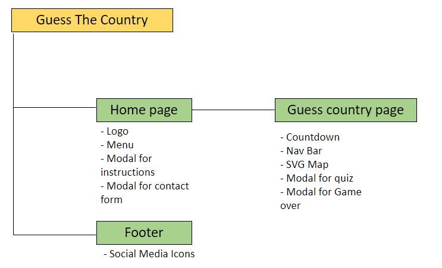
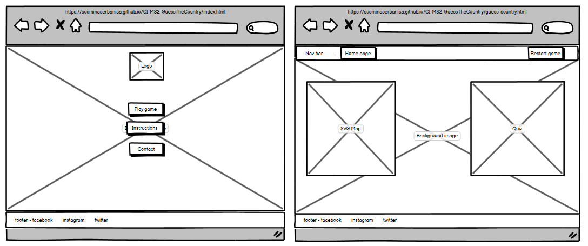
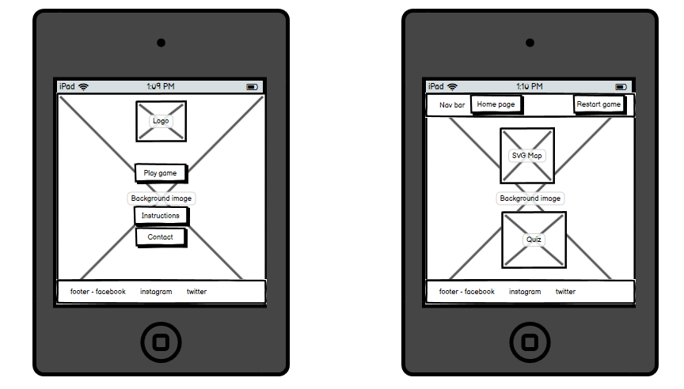
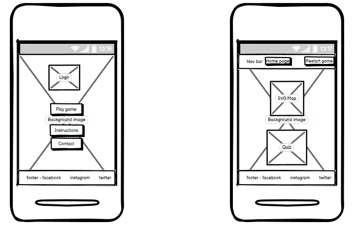
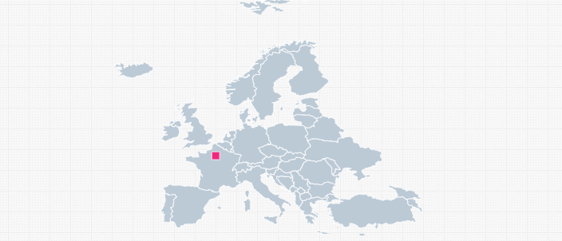
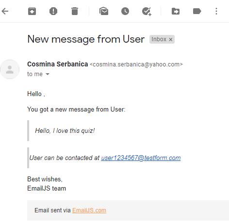
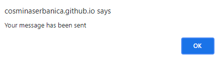

# Guess The Country- Europe Edition!

[View the live project here](https://cosminaserbanica.github.io/CI-MS2-GuessTheCountry/)

## Contents
1. [Introduction](#Introduction)
2. [UX](#UX)
    1. [Ideal User Demographic](#Ideal-User-Demographic)
    2. [User Stories](#User-Stories)
    3. [Development Planes](#Development-Planes)
    4. [Design](#Design)
3. [Features](#Features)
    1. [Design Features](#Design-Features) 
    2. [Existing Features](#Existing-Features)
    3. [Features to Implement in the future](#Features-to-Implement-in-the-future)
4. [Issues and Bugs](#Issues-and-Bugs)
5. [Technologies Used](#Technologies-Used)
     1. [Main Languages Used](#Main-Languages-Used)
     2. [Frameworks, Libraries & Programs Used](#Frameworks,-Libraries-&-Programs-Used)
6. [Testing](#Testing)
     1. [Testing.md](testing.md)
7. [Deployment](#Deployment)
     1. [Deploying on GitHub Pages](#Deploying-on-GitHub-Pages)
     2. [Forking the Repository](#Forking-the-Repository)
     3. [Creating a Clone](#Creating-a-Clone)
8. [Credits](#Credits)
     1. [Content](#Content)
     2. [Media](#Media)
     3. [Code](#Code)
9. [Acknowledgements](#Acknowledgements)
***

## Introduction

This web application was designed with a mobile first approach in mind, with the main purpose to combine the fun of an interactive game with improving geography knowledge. 

I got my inspiration from the paper blank maps we had back in highschool where we had to guess the countries, as preparation for the Baccalaureate exam at Geography. Back then, I would have found it a lot more useful and more fun to study if there was a game or a web application as such instead of just paper maps. So with this idea in mind I have made this web application.

This is also the second Milestone Project a student must complete as part of the Web Applications Development Program at Code Institute.

The main requirements were to make an interactive web application using primarily **HTML5**, **CSS3** and **Vanilla Javascript**.

## UX 

### Ideal User Demographic
#### The ideal user of this web application is:
- New players
- Current players

### User Stories
#### New Players Goals:
1. Easily navigate through the web application to find information on how to play the game, play the game and get in touch with the developer.
2. Be able to find out easily how to play the game.
3. Find out who developed the game.
4. Easily get in touch with the developer for any queries.
5. Be able to prepare for the game.
6. Easily Restart the game or navigate back to the main page.
7. Know exactly what level of knowledge the player has after going through the whole length of the game.
8. Have fun as well as improving geography skills.
#### Current Players Goals:
1. Easily navigate through the content in order to play the game again.
2. Be able to get in touch easily with the developer.
3. Be able to restart the game anytime throughout they feel the need to start again.
4. Measure their knowledge at the end of every game.

### Development Planes
In order to develop and promote an interactive web application, Guess The Country has been created based on:
#### Strategy
The targeted audience:
- Students preparing for GCSE exam or A Levels at Geography.
- Students preparing for any other exam that requires relevant geographical knowledge.
- Individuals who want to test or improve their current knowledge.
- Individuals who want to be entertained by an interactive game.
- Age group: suitable for any age group

The **user** can use the web application for:
- Educational purposes, to prepare for an exam.
- Improving general knowledge on maps.
- Entertainment, as this web application is a multiple choice quiz.
- Getting in touch with the developer for any queries or suggestions via contact form.
- Get in touch with the developer via social media platforms.

The **developer** can use the web application to:
- Improve their own geography skills, as this is a game the developer will play themselves.
- Add a new application to their portfolio.
- Improve their newly learned languages and skills.
- Learn how to use an API.

#### Scope
After defining the strategy, the scope was developed based on the following requirements:
- **User Requirements**
     - The user will be looking to:
          - Play a fun and interactive game.
          - Information about how to play the game.
          - How to get in touch with the developer.
          - Easily navigate through the application through minimum of clicks.
          - Improve their general knowledge on maps.
          - Choose the correct answer from a selection of multiple answers.
          - Know exactly how many answers has guessed right in order to correctly measure knowledge.
          - Restart the game anytime they feel necessary or play again.
- **How the user requirements have been met**
     - The user will be able to:
          - Navigate through the site with minimum clicks in order to find the information they want or to play the game.
          - Be able to find links to external sites in order to connect with the developer on social media.
          - Play the game for as many times as they want in order to achieve the desired level of knowledge.
          - Get in touch with the developer through a form that automatically sends the message to the developers personal inbox.

#### Structure
With the previously identified strategy and scope, the ideal structure was agreed to match the following diagram:

#### Skeleton
**Skeleton** has been put together using [Balsamiq wireframes](https://balsamiq.com/ "Link to Balsamiq wireframes")
- Wireframes for desktop: 

- Wireframes for Ipad:

- Wireframes for smarthphone:
 

### Design

#### Colour Scheme
The main colours used throughout the website are a shade of khaki for the background, a dark gray for the nav bar, the footer and the modals and purple for the buttons. White font has been used throughout the application to meet contrast standards. 

#### Typography
The fonts used are [Roboto](https://fonts.google.com/specimen/Roboto "Link to Roboto Google Font") for the Logo situated on the Main page with Sans Serif as the fallback in case of import failure and Consolas font is used for the buttons, questions and answers throughout the game.

#### Imagery
The images selected have been used with a main purpose of highlighting the profile of the application, which is a geography related quiz.

The background images used on the main page, respectively on the 404 error page have been sourced by [Unsplash](https://unsplash.com/ "Link to https://unsplash.com/").

The background image used on the quiz page has been sourced from [WallpaperAccess](https://wallpaperaccess.com/ "Link to https://www.wallpaperaccess.com").

The Map of Europe in SVG format has been sourced from [SimpleMaps](https://https://simplemaps.com/ "Link to https://www.simplemaps.com") and edited by the developer in [Figma](https://https://figma.com/ "Link to https://www.figma.com") in order to get each country attribute (ex: vector id).
- Original Earth Globe SVG before being edited by the developer:

The Logo Guess the Country has been created by the developer using SVG image from [Undraw](https://undraw.co/illustrations "Link to https://www.simplemaps.com") and edited to achieve the end result in [Figma](https://https://figma.com/ "Link to https://www.figma.com").
- Original Earth Globe SVG before being edited by the developer to achieve the end result (current logo):

## Features

### Design Features

<dl>
  <dt><a href="index.html" alt="Guess The Country Home Page">Home Page</a></dt>
  <dd>The Home Page design was meant to be simplistic to improve the user experience, containing the following elements:
     <ul>
          <li><strong>The Logo</strong> - Contains a text iterating the name of the web application surrounding the Earth Globe, to highlight the profile or the quiz - geography. 
          </li>
          <li><strong>Europe Edition</strong> The developer felt the need to mention that this version of the game is Europe Edition, so the user can expect to find the Europe Map only in this current version. More maps of other continents will be made available in the future.
          </li>
          <li><strong>The menu</strong> - Positioned in the center of the page, with only 3 controls (Play game, Instructions and Contact) it enables the user to access the game quickly, with minimum of clicks, as well as the instructions modal and the contact form. 
          </li>
          <li><strong>The footer</strong> - Positioned at the bottom of the page, enables the user to connect with the developer on social media platforms.
          </li>
     </ul>
  </dd>

<dl>
  <dt><a href="guess-country.html" alt="Guess the country Page">Quiz page</a></dt>
  <dd>The Quiz Page is divided in two sections, one containing the Europe Map, and the other containing the quiz modal, and the modal for the end of the game. 
     <ul>
          <li><strong>The Countdown</strong> - When the page is loaded, a 3 seconds countdown will take place in order to prepare the user for the start of the quiz.
          </li>
          <li><strong>Europe Map</strong> - The blank Map contains all the countries from the European continent in the shape of Vectors. The developer chose to use the SVG because of the need to call different Vectors while building the quiz logic. Every country gets highlighted in yellow when the question loads; It turns green if the user guesses which country it is, or red if the user guesses wrong. The Map displays only when the countdown has ended.
          </li>
          <li><strong>The Quiz Modal</strong> - When the countdown has ended, the quiz modal displays on the left side of the screen on desktop, or underneath the Map on mobile or tablet. The Quiz Modal contains the question, the multiple choice answers, the timer for each question, the score and the toggle for sound.
          </li>
          <li><strong>End of Game Modal</strong> - Once all 42 questions have been displayed, the Quiz Modal will hide and the end of game modal will appear. This modal informs the user about how many questions they have guessed correctly out of the 42 and give the user the option to either play again or return to home page.
          </li>
          <li><strong>Nav Bar</strong> - The developer has added a Nav Bar at the top of the page to improve the user experience by enabling the user to either restart game anytime during the quiz either return to Home Page. The nav bar displays after the countdown has ended.
          </li>
          <li><strong>The footer</strong> - Positioned at the bottom of the page, enables the user to connect with the developer on social media platforms.
          </li>
     </ul>
  </dd>

### Existing Features
- **Play Game Button** - The first option on the home page menu, when clicked, it directs the user to the quiz page.
- **Instructions Button** - Situated right underneath the Play Game Button, when clicked, it opens up the **Instructions Modal** where the user can find details on how to play the game. The modal can be closed by either clicking on the **X icon** on the right top corner of the modal, either by clicking anywhere outside the modal window.
- **Contact Button** - The last button in the menu, when clicked it opens up a modal containing the contact form, which the user can fill in to get in touch with the developer. The modal can be closed by either clicking on the **X icon** on the right top corner of the modal, either by clicking anywhere outside the modal window.
- **Email JS API** - Using guidance from the Code Institute tutoring video, the developer has implemented this API to this web application. When the user submits the contact form, the developer will receive their message in their personal inbox.
 
- **Alert for message sent** - Once the user has clicked **submit** on the form, a pop up alert will let the user know what the message has been sent.

- **Social Icons** - Situated in the footer, they are being displayed on every page.
- **Header Navigation Bar** - Displayed on every page to facilitate navigation.
- **Countdown** - Right before displaying all the content of the quiz page, there will be a 3 seconds countdown to let the user prepare for the start of the quiz.
- **SVG Map of Europe** - An SVG map where each each country is being automatically highlighted to point out which country the user has to guess.
- **Beat the clock** - A timer for each question. The user has 5 seconds to select an answer. If the user does not select an answer within the 5 seconds, the highlighted country in the map will turn red, as this will be classed as a missed/wrong answer.
- **Sound on/off** - Sound has been added to the quiz, for the click event, as well as the correct or wrong answers. The user can turn the sound off by clicking on the sound icon at the top right corner of the modal.
- **Question Counter** - Question counter has been implemented to inform the user how far in the game they currently are. 
- **Score** - For each question answered correctly the user gets 10 points.
- **404 page** - A 404 Error page has been created to re-direct the user back to the Home page.

### Features to Implement in the future
- **The rest of the continents**
     - **Feature** - An option for the user to select continents, other than Europe and guess the countries from there.
     - **Reason for not implementing it** - One continent is enough to meet the requirements for this project at this current stage.
      - **Feature** - An option for the user to Register, Log in, save their current score and share their progress on Social Media.
      - **Reason for not implementing it** - This feature will need a full stack development. The developer does not yet have the knowledge to develop it.