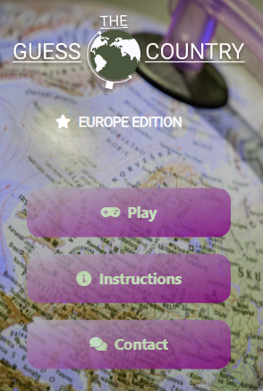
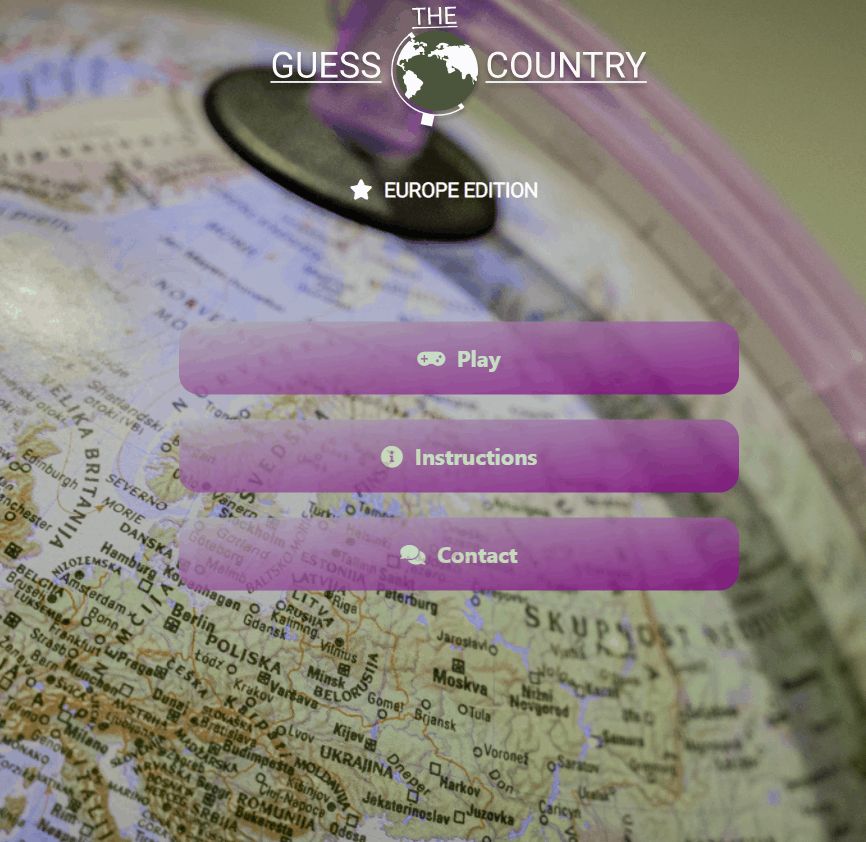
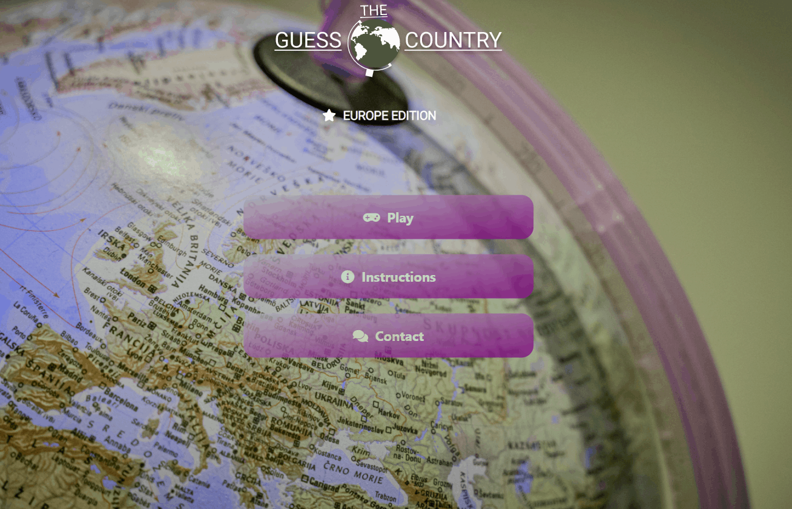
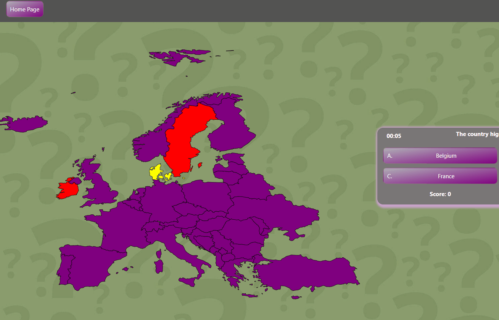
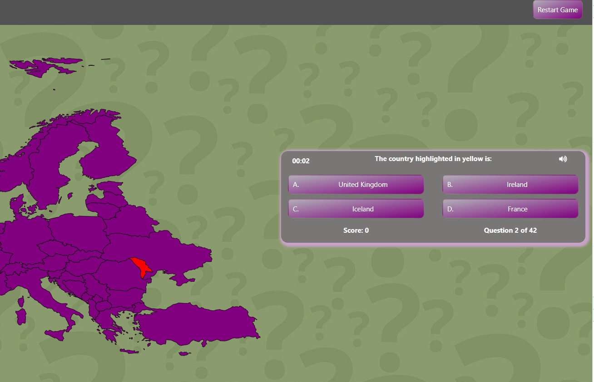
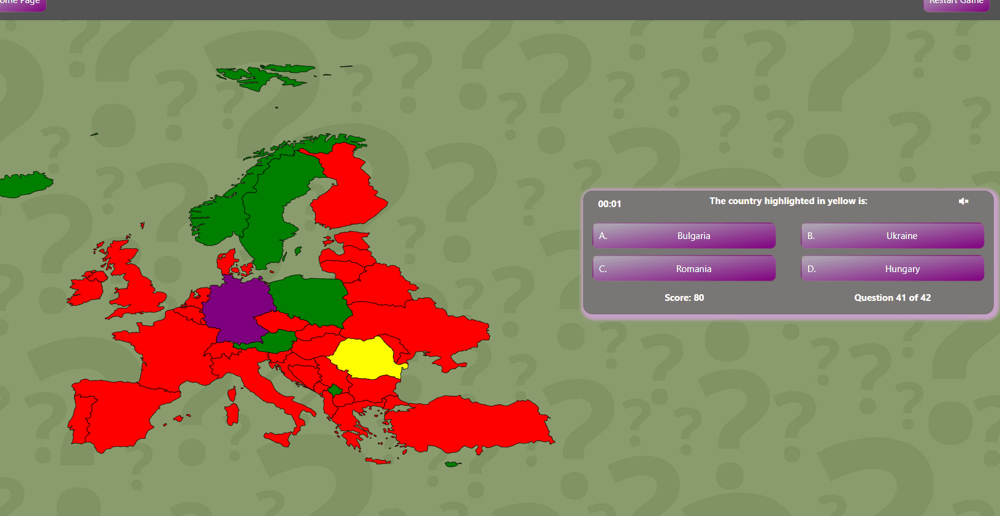

***

# Guess the Country Testing 

[Back to README.md file](/README.md)

## Contents
1. [Testing User Stories](#Testing-User-Stories)
2. [Manual Testing](#Manual-Testing)
3. [Automated Testing](#Automated-Testing)    
     - [Code Validation](#Code-Validation)
     - [Lighthouse Auditing](#Lighthouse-Auditing)
     - [Responsiveness](#Responsiveness)

## Testing User Stories

#### New and Current Player Goals:
1. Easily navigate through the web application to find information on how to play the game, play the game and get in touch with the developer.

2. Be able to find out easily how to play the game.

3.  Find out who developed the game.

4. Easily get in touch with the developer for any queries.

5. Be able to prepare for the game, thanks to the 3 seconds countdown before start of quiz.

6. Easily Restart the game or navigate back to the main page.

7. Know exactly what level of knowledge the player has after going through the whole length of the game.

