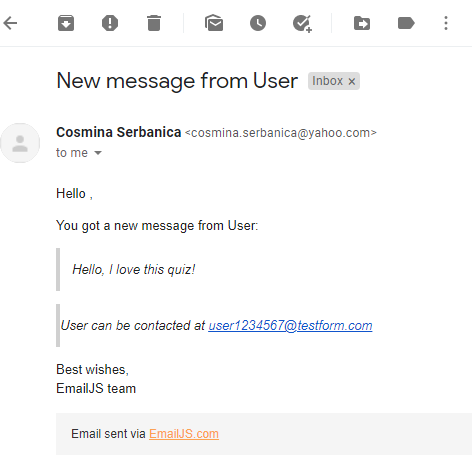
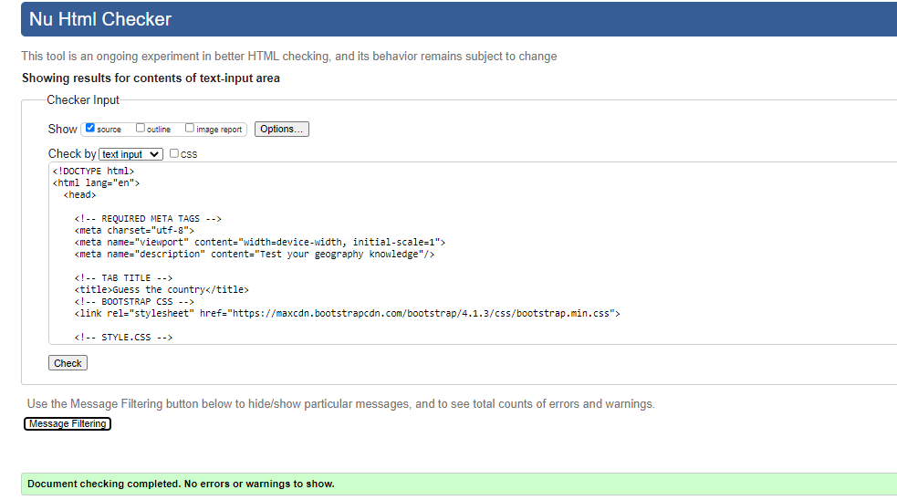

***

# Guess the Country Testing 

[Back to README.md file](/README.md)

## Contents
1. [Testing User Stories](#Testing-User-Stories)
2. [Manual Testing](#Manual-Testing)
3. [Automated Testing](#Automated-Testing)    
     - [Code Validation](#Code-Validation)
     - [Lighthouse Auditing](#Lighthouse-Auditing)
     - [Responsiveness](#Responsiveness)

## Testing User Stories

#### New and Current Player Goals:
1. Easily navigate through the web application to find information on how to play the game, play the game and get in touch with the developer.

2. Be able to find out easily how to play the game.

3.  Find out who developed the game.

4. Easily get in touch with the developer for any queries.

5. Be able to prepare for the game, thanks to the 3 seconds countdown before start of quiz.

6. Easily Restart the game or navigate back to the main page.

7. Know exactly what level of knowledge the player has after going through the whole length of the game.

## Manual Testing

I manually tested every element myself to ensure they are functional.

1. I tested the website layout on different browsers to ensure it looked good. I used: Chrome, Safari, Opera, Firefox, Edge and Brave.

2. On mobile devices, the website was tested on Iphone 6, Iphone 11 plus and Samsung Galaxy S10. 

3. The contact form:

    - I manually tested the form to ensure proper display and functionality.
    - I filled in all permutations of fields, leaving one required field empty each time to make sure I was always prompted to fill in the empty field.
    - I filled in a wrongly formatted email address to test that the user would be prompted to fill in a valid email address.
    - I filled in all fields of the form correctly and submitted it to ensure the Email JS API works.

     
 

4. I manually checked each social media link from the footer, to make sure they are all opening in a new window and to the correct address.

5. I checked that all the internal navigation was working as it should.

## Code Validation

The HTML code has been validated using [W3 HTML Validator](https://validator.w3.org):

#### <strong>Home Page Validation</strong>
  - No errors or warning shown.
    

#### <strong>Quiz Page Validation</strong>
  - The warning have been ignored because the headings are being populated with Javascript.
    

The CSS code has been validated using [W3 CSS Validator](https://jigsaw.w3.org/css-validator/):

- No errors or warnings shown: 
  

## Lighthouse auditing

#### <strong> Home Page</strong>
  

#### <strong> Quiz Page</strong>
  

## Responsiveness

  - In order to test my website for responsiveness on different size devices I have used [Screenfly](https://bluetree.ai/screenfly/?u=https%3A//cosminaserbanica.github.io/CI-MS2-GuessTheCountry/&a=19&b=10) which offers a larger option of devices to test your website.
  - To view my website on different devices, please follow this [link](https://bluetree.ai/screenfly/?u=https%3A//cosminaserbanica.github.io/CI-MS2-GuessTheCountry/&a=19&b=10).
  - Every page on the website was responsive on all devices provided on the Screenfly tool.
  - Example: 
  
  

***